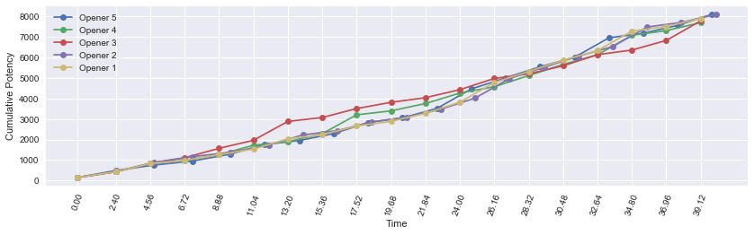

<a id="header"></a>
# Part 2: levels 50-51

[Return home](../)


```python
from samurai import *
from plotting import *

import matplotlib.pyplot as plt
import pandas as pd
import numpy as np
import seaborn as sb
from IPython.display import display
%matplotlib inline

pd.options.display.max_rows = None
```

## lvl 50

Level 50 unlocks the final weaponskill, Yukikaze, a combo finisher to open the final Sen, Setsu. It combos from Hakaze so it is a two hit combo contrary to Gekko and Kasha. It applies a slashing resistance down debuff to the target.

Level 50 also confers the Meikyo Shisui ability, a cooldown that allows you to execute up to 3 combo abilities without meeting combo prerequisites. This may be used, for example, to quickly get Jinpu and Shifu buffs up or to open up all three Sen in a fraction of the time as normal. Note that Iaijutsu do not consume a charge. Additionally, any combo actions used during Meikyo Shisui will not continue after the buff falls off. For example, if you use the last charge on Jinpu, the combo action for Gekko will not be primed after Meikyo Shisui falls off.

The opening of the final Sen unlocks the final Iaijutsu, Midare Setsugekka. This powerful single target nuke gives the opportunity in single target situations to deal massive damage without having to clip Higanbana.

With our repertoire of weaponskills complete plus a new cooldown to play with, let's explore opener options.

## Opener 1
Buff first: Shifu > Jinpu > Yukikaze.

Iaijutsu: Apply Higanbana after getting Jinpu buff. Remaining Sen build towards Midare Setsugekka. 

Meikyo Shisui: generate second Midare Setsugekka. 


```python
sam = Samurai()

n_targets = 1

actions = [('Hakaze'), ('Shifu'), ('Kasha'), ('Hakaze'),
           ('Jinpu'), ('Higanbana'), ('Gekko'), ('Hakaze'),
           ('Yukikaze'), ('Hakaze'), ('Shifu'), ('Kasha'),
           ('Midare Setsugekka', 'Meikyo Shisui'), ('Kasha'), ('Gekko'), ('Yukikaze'), 
           ('Midare Setsugekka'),
           ('Hakaze'), ('Jinpu'), ('Gekko'),
           ('Hakaze'), ('Yukikaze')]
```


```python
df0, average_potency, pps = sam.parse_rotation(actions)
display(df0)
```

    average potency per GCD = 411.8647727272726
    average potency per second = 189.719953936
    


<div>
<style>
    .dataframe thead tr:only-child th {
        text-align: right;
    }

    .dataframe thead th {
        text-align: left;
    }

    .dataframe tbody tr th {
        vertical-align: top;
    }
</style>
<table border="1" class="dataframe">
  <thead>
    <tr style="text-align: right;">
      <th></th>
      <th>Time</th>
      <th>Weaponskill</th>
      <th>Ability</th>
      <th>Potency</th>
      <th>Jinpu</th>
      <th>Shifu</th>
      <th>Yukikaze</th>
      <th>Higanbana</th>
      <th>Kenki</th>
      <th>Total Potency</th>
    </tr>
  </thead>
  <tbody>
    <tr>
      <th>0</th>
      <td>0.00</td>
      <td>Hakaze</td>
      <td></td>
      <td>150.000</td>
      <td>False</td>
      <td>False</td>
      <td>False</td>
      <td>0</td>
      <td>0</td>
      <td>150.000</td>
    </tr>
    <tr>
      <th>1</th>
      <td>2.40</td>
      <td>Shifu</td>
      <td></td>
      <td>280.000</td>
      <td>False</td>
      <td>False</td>
      <td>False</td>
      <td>0</td>
      <td>0</td>
      <td>430.000</td>
    </tr>
    <tr>
      <th>2</th>
      <td>4.56</td>
      <td>Kasha</td>
      <td></td>
      <td>400.000</td>
      <td>False</td>
      <td>True</td>
      <td>False</td>
      <td>0</td>
      <td>0</td>
      <td>830.000</td>
    </tr>
    <tr>
      <th>3</th>
      <td>6.72</td>
      <td>Hakaze</td>
      <td></td>
      <td>150.000</td>
      <td>False</td>
      <td>True</td>
      <td>False</td>
      <td>0</td>
      <td>0</td>
      <td>980.000</td>
    </tr>
    <tr>
      <th>4</th>
      <td>8.88</td>
      <td>Jinpu</td>
      <td></td>
      <td>280.000</td>
      <td>False</td>
      <td>True</td>
      <td>False</td>
      <td>0</td>
      <td>0</td>
      <td>1260.000</td>
    </tr>
    <tr>
      <th>5</th>
      <td>11.04</td>
      <td>Higanbana</td>
      <td></td>
      <td>276.000</td>
      <td>True</td>
      <td>True</td>
      <td>False</td>
      <td>0</td>
      <td>0</td>
      <td>1536.000</td>
    </tr>
    <tr>
      <th>6</th>
      <td>13.20</td>
      <td>Gekko</td>
      <td></td>
      <td>488.980</td>
      <td>True</td>
      <td>True</td>
      <td>False</td>
      <td>1</td>
      <td>0</td>
      <td>2024.980</td>
    </tr>
    <tr>
      <th>7</th>
      <td>15.36</td>
      <td>Hakaze</td>
      <td></td>
      <td>201.480</td>
      <td>True</td>
      <td>True</td>
      <td>False</td>
      <td>1</td>
      <td>0</td>
      <td>2226.460</td>
    </tr>
    <tr>
      <th>8</th>
      <td>17.52</td>
      <td>Yukikaze</td>
      <td></td>
      <td>419.980</td>
      <td>True</td>
      <td>True</td>
      <td>False</td>
      <td>1</td>
      <td>0</td>
      <td>2646.440</td>
    </tr>
    <tr>
      <th>9</th>
      <td>19.68</td>
      <td>Hakaze</td>
      <td></td>
      <td>220.455</td>
      <td>True</td>
      <td>True</td>
      <td>True</td>
      <td>1</td>
      <td>0</td>
      <td>2866.895</td>
    </tr>
    <tr>
      <th>10</th>
      <td>21.84</td>
      <td>Shifu</td>
      <td></td>
      <td>386.400</td>
      <td>True</td>
      <td>True</td>
      <td>True</td>
      <td>1</td>
      <td>0</td>
      <td>3253.295</td>
    </tr>
    <tr>
      <th>11</th>
      <td>24.00</td>
      <td>Kasha</td>
      <td></td>
      <td>539.580</td>
      <td>True</td>
      <td>True</td>
      <td>True</td>
      <td>1</td>
      <td>0</td>
      <td>3792.875</td>
    </tr>
    <tr>
      <th>12</th>
      <td>26.16</td>
      <td>Midare Setsugekka</td>
      <td>Meikyo Shisui</td>
      <td>948.060</td>
      <td>True</td>
      <td>True</td>
      <td>True</td>
      <td>1</td>
      <td>0</td>
      <td>4740.935</td>
    </tr>
    <tr>
      <th>13</th>
      <td>28.32</td>
      <td>Kasha</td>
      <td></td>
      <td>539.580</td>
      <td>True</td>
      <td>True</td>
      <td>True</td>
      <td>1</td>
      <td>0</td>
      <td>5280.515</td>
    </tr>
    <tr>
      <th>14</th>
      <td>30.48</td>
      <td>Gekko</td>
      <td></td>
      <td>539.580</td>
      <td>True</td>
      <td>True</td>
      <td>True</td>
      <td>1</td>
      <td>0</td>
      <td>5820.095</td>
    </tr>
    <tr>
      <th>15</th>
      <td>32.64</td>
      <td>Yukikaze</td>
      <td></td>
      <td>462.990</td>
      <td>True</td>
      <td>True</td>
      <td>True</td>
      <td>1</td>
      <td>0</td>
      <td>6283.085</td>
    </tr>
    <tr>
      <th>16</th>
      <td>34.80</td>
      <td>Midare Setsugekka</td>
      <td></td>
      <td>948.060</td>
      <td>True</td>
      <td>True</td>
      <td>True</td>
      <td>1</td>
      <td>0</td>
      <td>7231.145</td>
    </tr>
    <tr>
      <th>17</th>
      <td>36.96</td>
      <td>Hakaze</td>
      <td></td>
      <td>220.455</td>
      <td>True</td>
      <td>True</td>
      <td>True</td>
      <td>1</td>
      <td>0</td>
      <td>7451.600</td>
    </tr>
    <tr>
      <th>18</th>
      <td>39.12</td>
      <td>Jinpu</td>
      <td></td>
      <td>386.400</td>
      <td>False</td>
      <td>True</td>
      <td>True</td>
      <td>1</td>
      <td>0</td>
      <td>7838.000</td>
    </tr>
    <tr>
      <th>19</th>
      <td>41.28</td>
      <td>Gekko</td>
      <td></td>
      <td>539.580</td>
      <td>True</td>
      <td>True</td>
      <td>True</td>
      <td>1</td>
      <td>0</td>
      <td>8377.580</td>
    </tr>
    <tr>
      <th>20</th>
      <td>43.44</td>
      <td>Hakaze</td>
      <td></td>
      <td>220.455</td>
      <td>True</td>
      <td>True</td>
      <td>True</td>
      <td>1</td>
      <td>0</td>
      <td>8598.035</td>
    </tr>
    <tr>
      <th>21</th>
      <td>45.60</td>
      <td>Yukikaze</td>
      <td></td>
      <td>462.990</td>
      <td>True</td>
      <td>True</td>
      <td>True</td>
      <td>1</td>
      <td>0</td>
      <td>9061.025</td>
    </tr>
  </tbody>
</table>
</div>


```python
plot_potency(df0)
```


## Opener 2
Similar to Opener 1, just prioritize the buffs Jinpu > Shifu > Yukikaze so that the Higanbana DoT is applied earlier.


```python
sam = Samurai()

n_targets = 1

actions = [('Hakaze'), ('Jinpu'), ('Gekko'), ('Higanbana'),
           ('Hakaze'), ('Shifu'), ('Kasha'), ('Hakaze'),
           ('Yukikaze'), ('Hakaze'), ('Jinpu'), ('Gekko'),
           ('Midare Setsugekka', 'Meikyo Shisui'), ('Kasha'), ('Gekko'), ('Yukikaze'),
           ('Midare Setsugekka'),
           ('Hakaze'), ('Shifu'), ('Kasha'),
           ('Hakaze'), ('Yukikaze')]
```


```python
df1, average_potency, pps = sam.parse_rotation(actions)
display(df1)
```

    average potency per GCD = 420.45113636363635
    average potency per second = 189.858887521
    


<div>
<style>
    .dataframe thead tr:only-child th {
        text-align: right;
    }

    .dataframe thead th {
        text-align: left;
    }

    .dataframe tbody tr th {
        vertical-align: top;
    }
</style>
<table border="1" class="dataframe">
  <thead>
    <tr style="text-align: right;">
      <th></th>
      <th>Time</th>
      <th>Weaponskill</th>
      <th>Ability</th>
      <th>Potency</th>
      <th>Jinpu</th>
      <th>Shifu</th>
      <th>Yukikaze</th>
      <th>Higanbana</th>
      <th>Kenki</th>
      <th>Total Potency</th>
    </tr>
  </thead>
  <tbody>
    <tr>
      <th>0</th>
      <td>0.00</td>
      <td>Hakaze</td>
      <td></td>
      <td>150.000</td>
      <td>False</td>
      <td>False</td>
      <td>False</td>
      <td>0</td>
      <td>0</td>
      <td>150.000</td>
    </tr>
    <tr>
      <th>1</th>
      <td>2.40</td>
      <td>Jinpu</td>
      <td></td>
      <td>280.000</td>
      <td>False</td>
      <td>False</td>
      <td>False</td>
      <td>0</td>
      <td>0</td>
      <td>430.000</td>
    </tr>
    <tr>
      <th>2</th>
      <td>4.80</td>
      <td>Gekko</td>
      <td></td>
      <td>460.000</td>
      <td>True</td>
      <td>False</td>
      <td>False</td>
      <td>0</td>
      <td>0</td>
      <td>890.000</td>
    </tr>
    <tr>
      <th>3</th>
      <td>7.20</td>
      <td>Higanbana</td>
      <td></td>
      <td>276.000</td>
      <td>True</td>
      <td>False</td>
      <td>False</td>
      <td>0</td>
      <td>0</td>
      <td>1166.000</td>
    </tr>
    <tr>
      <th>4</th>
      <td>9.60</td>
      <td>Hakaze</td>
      <td></td>
      <td>204.700</td>
      <td>True</td>
      <td>False</td>
      <td>False</td>
      <td>1</td>
      <td>0</td>
      <td>1370.700</td>
    </tr>
    <tr>
      <th>5</th>
      <td>12.00</td>
      <td>Shifu</td>
      <td></td>
      <td>354.200</td>
      <td>True</td>
      <td>False</td>
      <td>False</td>
      <td>1</td>
      <td>0</td>
      <td>1724.900</td>
    </tr>
    <tr>
      <th>6</th>
      <td>14.16</td>
      <td>Kasha</td>
      <td></td>
      <td>488.980</td>
      <td>True</td>
      <td>True</td>
      <td>False</td>
      <td>1</td>
      <td>0</td>
      <td>2213.880</td>
    </tr>
    <tr>
      <th>7</th>
      <td>16.32</td>
      <td>Hakaze</td>
      <td></td>
      <td>201.480</td>
      <td>True</td>
      <td>True</td>
      <td>False</td>
      <td>1</td>
      <td>0</td>
      <td>2415.360</td>
    </tr>
    <tr>
      <th>8</th>
      <td>18.48</td>
      <td>Yukikaze</td>
      <td></td>
      <td>419.980</td>
      <td>True</td>
      <td>True</td>
      <td>False</td>
      <td>1</td>
      <td>0</td>
      <td>2835.340</td>
    </tr>
    <tr>
      <th>9</th>
      <td>20.64</td>
      <td>Hakaze</td>
      <td></td>
      <td>220.455</td>
      <td>True</td>
      <td>True</td>
      <td>True</td>
      <td>1</td>
      <td>0</td>
      <td>3055.795</td>
    </tr>
    <tr>
      <th>10</th>
      <td>22.80</td>
      <td>Jinpu</td>
      <td></td>
      <td>386.400</td>
      <td>True</td>
      <td>True</td>
      <td>True</td>
      <td>1</td>
      <td>0</td>
      <td>3442.195</td>
    </tr>
    <tr>
      <th>11</th>
      <td>24.96</td>
      <td>Gekko</td>
      <td></td>
      <td>539.580</td>
      <td>True</td>
      <td>True</td>
      <td>True</td>
      <td>1</td>
      <td>0</td>
      <td>3981.775</td>
    </tr>
    <tr>
      <th>12</th>
      <td>27.12</td>
      <td>Midare Setsugekka</td>
      <td>Meikyo Shisui</td>
      <td>948.060</td>
      <td>True</td>
      <td>True</td>
      <td>True</td>
      <td>1</td>
      <td>0</td>
      <td>4929.835</td>
    </tr>
    <tr>
      <th>13</th>
      <td>29.28</td>
      <td>Kasha</td>
      <td></td>
      <td>539.580</td>
      <td>True</td>
      <td>True</td>
      <td>True</td>
      <td>1</td>
      <td>0</td>
      <td>5469.415</td>
    </tr>
    <tr>
      <th>14</th>
      <td>31.44</td>
      <td>Gekko</td>
      <td></td>
      <td>539.580</td>
      <td>True</td>
      <td>True</td>
      <td>True</td>
      <td>1</td>
      <td>0</td>
      <td>6008.995</td>
    </tr>
    <tr>
      <th>15</th>
      <td>33.60</td>
      <td>Yukikaze</td>
      <td></td>
      <td>462.990</td>
      <td>True</td>
      <td>True</td>
      <td>True</td>
      <td>1</td>
      <td>0</td>
      <td>6471.985</td>
    </tr>
    <tr>
      <th>16</th>
      <td>35.76</td>
      <td>Midare Setsugekka</td>
      <td></td>
      <td>948.060</td>
      <td>True</td>
      <td>True</td>
      <td>True</td>
      <td>1</td>
      <td>0</td>
      <td>7420.045</td>
    </tr>
    <tr>
      <th>17</th>
      <td>37.92</td>
      <td>Hakaze</td>
      <td></td>
      <td>220.455</td>
      <td>True</td>
      <td>True</td>
      <td>True</td>
      <td>1</td>
      <td>0</td>
      <td>7640.500</td>
    </tr>
    <tr>
      <th>18</th>
      <td>40.08</td>
      <td>Shifu</td>
      <td></td>
      <td>386.400</td>
      <td>True</td>
      <td>True</td>
      <td>True</td>
      <td>1</td>
      <td>0</td>
      <td>8026.900</td>
    </tr>
    <tr>
      <th>19</th>
      <td>42.24</td>
      <td>Kasha</td>
      <td></td>
      <td>539.580</td>
      <td>True</td>
      <td>True</td>
      <td>True</td>
      <td>1</td>
      <td>0</td>
      <td>8566.480</td>
    </tr>
    <tr>
      <th>20</th>
      <td>44.40</td>
      <td>Hakaze</td>
      <td></td>
      <td>220.455</td>
      <td>True</td>
      <td>True</td>
      <td>True</td>
      <td>1</td>
      <td>0</td>
      <td>8786.935</td>
    </tr>
    <tr>
      <th>21</th>
      <td>46.56</td>
      <td>Yukikaze</td>
      <td></td>
      <td>462.990</td>
      <td>True</td>
      <td>True</td>
      <td>True</td>
      <td>1</td>
      <td>0</td>
      <td>9249.925</td>
    </tr>
  </tbody>
</table>
</div>


```python
plot_potency(df1)
```


## Opener 3
Open with Meikyo Shisui to apply buffs and debuffs ASAP.

Iaijutsu: Apply Higanbana first. Remaining Sen build towards Midare Setsugekka.


```python
sam = Samurai()

n_targets = 1

sam.meikyo_shisui()

actions = [('Jinpu'), ('Shifu'), ('Yukikaze'),
           ('Higanbana'),
           ('Hakaze'), ('Shifu'), ('Kasha'),
           ('Hakaze'), ('Yukikaze'),
           ('Hakaze'), ('Jinpu'), ('Gekko'),
           ('Midare Setsugekka'),
           ('Hakaze'), ('Shifu'), ('Kasha'),
           ('Hakaze'), ('Yukikaze'),
           ('Hakaze'), ('Jinpu'), ('Gekko'),
           ('Midare Setsugekka')]
```


```python
df2, average_potency, pps = sam.parse_rotation(actions)
display(df2)
```

    average potency per GCD = 415.8231818181817
    average potency per second = 191.543341709
    


<div>
<style>
    .dataframe thead tr:only-child th {
        text-align: right;
    }

    .dataframe thead th {
        text-align: left;
    }

    .dataframe tbody tr th {
        vertical-align: top;
    }
</style>
<table border="1" class="dataframe">
  <thead>
    <tr style="text-align: right;">
      <th></th>
      <th>Time</th>
      <th>Weaponskill</th>
      <th>Ability</th>
      <th>Potency</th>
      <th>Jinpu</th>
      <th>Shifu</th>
      <th>Yukikaze</th>
      <th>Higanbana</th>
      <th>Kenki</th>
      <th>Total Potency</th>
    </tr>
  </thead>
  <tbody>
    <tr>
      <th>0</th>
      <td>0.00</td>
      <td>Jinpu</td>
      <td></td>
      <td>280.000</td>
      <td>False</td>
      <td>False</td>
      <td>False</td>
      <td>0</td>
      <td>0</td>
      <td>280.000</td>
    </tr>
    <tr>
      <th>1</th>
      <td>2.40</td>
      <td>Shifu</td>
      <td></td>
      <td>322.000</td>
      <td>True</td>
      <td>False</td>
      <td>False</td>
      <td>0</td>
      <td>0</td>
      <td>602.000</td>
    </tr>
    <tr>
      <th>2</th>
      <td>4.56</td>
      <td>Yukikaze</td>
      <td></td>
      <td>391.000</td>
      <td>True</td>
      <td>True</td>
      <td>False</td>
      <td>0</td>
      <td>0</td>
      <td>993.000</td>
    </tr>
    <tr>
      <th>3</th>
      <td>6.72</td>
      <td>Higanbana</td>
      <td></td>
      <td>306.360</td>
      <td>True</td>
      <td>True</td>
      <td>True</td>
      <td>0</td>
      <td>0</td>
      <td>1299.360</td>
    </tr>
    <tr>
      <th>4</th>
      <td>8.88</td>
      <td>Hakaze</td>
      <td></td>
      <td>220.455</td>
      <td>True</td>
      <td>True</td>
      <td>True</td>
      <td>1</td>
      <td>0</td>
      <td>1519.815</td>
    </tr>
    <tr>
      <th>5</th>
      <td>11.04</td>
      <td>Shifu</td>
      <td></td>
      <td>386.400</td>
      <td>True</td>
      <td>True</td>
      <td>True</td>
      <td>1</td>
      <td>0</td>
      <td>1906.215</td>
    </tr>
    <tr>
      <th>6</th>
      <td>13.20</td>
      <td>Kasha</td>
      <td></td>
      <td>539.580</td>
      <td>True</td>
      <td>True</td>
      <td>True</td>
      <td>1</td>
      <td>0</td>
      <td>2445.795</td>
    </tr>
    <tr>
      <th>7</th>
      <td>15.36</td>
      <td>Hakaze</td>
      <td></td>
      <td>220.455</td>
      <td>True</td>
      <td>True</td>
      <td>True</td>
      <td>1</td>
      <td>0</td>
      <td>2666.250</td>
    </tr>
    <tr>
      <th>8</th>
      <td>17.52</td>
      <td>Yukikaze</td>
      <td></td>
      <td>462.990</td>
      <td>True</td>
      <td>True</td>
      <td>True</td>
      <td>1</td>
      <td>0</td>
      <td>3129.240</td>
    </tr>
    <tr>
      <th>9</th>
      <td>19.68</td>
      <td>Hakaze</td>
      <td></td>
      <td>220.455</td>
      <td>True</td>
      <td>True</td>
      <td>True</td>
      <td>1</td>
      <td>0</td>
      <td>3349.695</td>
    </tr>
    <tr>
      <th>10</th>
      <td>21.84</td>
      <td>Jinpu</td>
      <td></td>
      <td>386.400</td>
      <td>True</td>
      <td>True</td>
      <td>True</td>
      <td>1</td>
      <td>0</td>
      <td>3736.095</td>
    </tr>
    <tr>
      <th>11</th>
      <td>24.00</td>
      <td>Gekko</td>
      <td></td>
      <td>539.580</td>
      <td>True</td>
      <td>True</td>
      <td>True</td>
      <td>1</td>
      <td>0</td>
      <td>4275.675</td>
    </tr>
    <tr>
      <th>12</th>
      <td>26.16</td>
      <td>Midare Setsugekka</td>
      <td></td>
      <td>948.060</td>
      <td>True</td>
      <td>True</td>
      <td>True</td>
      <td>1</td>
      <td>0</td>
      <td>5223.735</td>
    </tr>
    <tr>
      <th>13</th>
      <td>28.32</td>
      <td>Hakaze</td>
      <td></td>
      <td>220.455</td>
      <td>True</td>
      <td>True</td>
      <td>True</td>
      <td>1</td>
      <td>0</td>
      <td>5444.190</td>
    </tr>
    <tr>
      <th>14</th>
      <td>30.48</td>
      <td>Shifu</td>
      <td></td>
      <td>386.400</td>
      <td>True</td>
      <td>True</td>
      <td>True</td>
      <td>1</td>
      <td>0</td>
      <td>5830.590</td>
    </tr>
    <tr>
      <th>15</th>
      <td>32.64</td>
      <td>Kasha</td>
      <td></td>
      <td>539.580</td>
      <td>True</td>
      <td>True</td>
      <td>True</td>
      <td>1</td>
      <td>0</td>
      <td>6370.170</td>
    </tr>
    <tr>
      <th>16</th>
      <td>34.80</td>
      <td>Hakaze</td>
      <td></td>
      <td>220.455</td>
      <td>True</td>
      <td>True</td>
      <td>True</td>
      <td>1</td>
      <td>0</td>
      <td>6590.625</td>
    </tr>
    <tr>
      <th>17</th>
      <td>36.96</td>
      <td>Yukikaze</td>
      <td></td>
      <td>462.990</td>
      <td>True</td>
      <td>True</td>
      <td>True</td>
      <td>1</td>
      <td>0</td>
      <td>7053.615</td>
    </tr>
    <tr>
      <th>18</th>
      <td>39.12</td>
      <td>Hakaze</td>
      <td></td>
      <td>220.455</td>
      <td>True</td>
      <td>True</td>
      <td>True</td>
      <td>1</td>
      <td>0</td>
      <td>7274.070</td>
    </tr>
    <tr>
      <th>19</th>
      <td>41.28</td>
      <td>Jinpu</td>
      <td></td>
      <td>386.400</td>
      <td>True</td>
      <td>True</td>
      <td>True</td>
      <td>1</td>
      <td>0</td>
      <td>7660.470</td>
    </tr>
    <tr>
      <th>20</th>
      <td>43.44</td>
      <td>Gekko</td>
      <td></td>
      <td>539.580</td>
      <td>True</td>
      <td>True</td>
      <td>True</td>
      <td>1</td>
      <td>0</td>
      <td>8200.050</td>
    </tr>
    <tr>
      <th>21</th>
      <td>45.60</td>
      <td>Midare Setsugekka</td>
      <td></td>
      <td>948.060</td>
      <td>True</td>
      <td>True</td>
      <td>True</td>
      <td>1</td>
      <td>0</td>
      <td>9148.110</td>
    </tr>
  </tbody>
</table>
</div>


```python
plot_potency(df2)
```


## Opener 4
Open with Yukikaze and use Meikyo Shisui to get Jinpu and Shifu up faster.

Iaijutsu: Apply Higanbana first.


```python
sam = Samurai()

n_targets = 1

actions = [('Hakaze'), ('Yukikaze', 'Meikyo Shisui'),
           ('Jinpu'), ('Higanbana'), ('Shifu'), ('Kasha'),
           ('Hakaze'), ('Jinpu'), ('Gekko'),
           ('Hakaze'), ('Yukikaze'),
           ('Midare Setsugekka'),
           ('Hakaze'), ('Shifu'), ('Kasha'),
           ('Hakaze'), ('Yukikaze'),
           ('Hakaze'), ('Jinpu'), ('Gekko'),
           ('Midare Setsugekka')]
```


```python
df3, average_potency, pps = sam.parse_rotation(actions)
display(df3)
```

    average potency per GCD = 416.1273809523808
    average potency per second = 188.658786701
    


<div>
<style>
    .dataframe thead tr:only-child th {
        text-align: right;
    }

    .dataframe thead th {
        text-align: left;
    }

    .dataframe tbody tr th {
        vertical-align: top;
    }
</style>
<table border="1" class="dataframe">
  <thead>
    <tr style="text-align: right;">
      <th></th>
      <th>Time</th>
      <th>Weaponskill</th>
      <th>Ability</th>
      <th>Potency</th>
      <th>Jinpu</th>
      <th>Shifu</th>
      <th>Yukikaze</th>
      <th>Higanbana</th>
      <th>Kenki</th>
      <th>Total Potency</th>
    </tr>
  </thead>
  <tbody>
    <tr>
      <th>0</th>
      <td>0.00</td>
      <td>Hakaze</td>
      <td></td>
      <td>150.000</td>
      <td>False</td>
      <td>False</td>
      <td>False</td>
      <td>0</td>
      <td>0</td>
      <td>150.000</td>
    </tr>
    <tr>
      <th>1</th>
      <td>2.40</td>
      <td>Yukikaze</td>
      <td>Meikyo Shisui</td>
      <td>340.000</td>
      <td>False</td>
      <td>False</td>
      <td>False</td>
      <td>0</td>
      <td>0</td>
      <td>490.000</td>
    </tr>
    <tr>
      <th>2</th>
      <td>4.80</td>
      <td>Jinpu</td>
      <td></td>
      <td>310.800</td>
      <td>False</td>
      <td>False</td>
      <td>True</td>
      <td>0</td>
      <td>0</td>
      <td>800.800</td>
    </tr>
    <tr>
      <th>3</th>
      <td>7.20</td>
      <td>Higanbana</td>
      <td></td>
      <td>306.360</td>
      <td>True</td>
      <td>False</td>
      <td>True</td>
      <td>0</td>
      <td>0</td>
      <td>1107.160</td>
    </tr>
    <tr>
      <th>4</th>
      <td>9.60</td>
      <td>Shifu</td>
      <td></td>
      <td>389.620</td>
      <td>True</td>
      <td>False</td>
      <td>True</td>
      <td>1</td>
      <td>0</td>
      <td>1496.780</td>
    </tr>
    <tr>
      <th>5</th>
      <td>11.76</td>
      <td>Kasha</td>
      <td></td>
      <td>539.580</td>
      <td>True</td>
      <td>True</td>
      <td>True</td>
      <td>1</td>
      <td>0</td>
      <td>2036.360</td>
    </tr>
    <tr>
      <th>6</th>
      <td>13.92</td>
      <td>Hakaze</td>
      <td></td>
      <td>220.455</td>
      <td>True</td>
      <td>True</td>
      <td>True</td>
      <td>1</td>
      <td>0</td>
      <td>2256.815</td>
    </tr>
    <tr>
      <th>7</th>
      <td>16.08</td>
      <td>Jinpu</td>
      <td></td>
      <td>386.400</td>
      <td>True</td>
      <td>True</td>
      <td>True</td>
      <td>1</td>
      <td>0</td>
      <td>2643.215</td>
    </tr>
    <tr>
      <th>8</th>
      <td>18.24</td>
      <td>Gekko</td>
      <td></td>
      <td>539.580</td>
      <td>True</td>
      <td>True</td>
      <td>True</td>
      <td>1</td>
      <td>0</td>
      <td>3182.795</td>
    </tr>
    <tr>
      <th>9</th>
      <td>20.40</td>
      <td>Hakaze</td>
      <td></td>
      <td>220.455</td>
      <td>True</td>
      <td>True</td>
      <td>True</td>
      <td>1</td>
      <td>0</td>
      <td>3403.250</td>
    </tr>
    <tr>
      <th>10</th>
      <td>22.56</td>
      <td>Yukikaze</td>
      <td></td>
      <td>462.990</td>
      <td>True</td>
      <td>True</td>
      <td>True</td>
      <td>1</td>
      <td>0</td>
      <td>3866.240</td>
    </tr>
    <tr>
      <th>11</th>
      <td>24.72</td>
      <td>Midare Setsugekka</td>
      <td></td>
      <td>948.060</td>
      <td>True</td>
      <td>True</td>
      <td>True</td>
      <td>1</td>
      <td>0</td>
      <td>4814.300</td>
    </tr>
    <tr>
      <th>12</th>
      <td>26.88</td>
      <td>Hakaze</td>
      <td></td>
      <td>220.455</td>
      <td>True</td>
      <td>True</td>
      <td>True</td>
      <td>1</td>
      <td>0</td>
      <td>5034.755</td>
    </tr>
    <tr>
      <th>13</th>
      <td>29.04</td>
      <td>Shifu</td>
      <td></td>
      <td>386.400</td>
      <td>True</td>
      <td>True</td>
      <td>True</td>
      <td>1</td>
      <td>0</td>
      <td>5421.155</td>
    </tr>
    <tr>
      <th>14</th>
      <td>31.20</td>
      <td>Kasha</td>
      <td></td>
      <td>539.580</td>
      <td>True</td>
      <td>True</td>
      <td>True</td>
      <td>1</td>
      <td>0</td>
      <td>5960.735</td>
    </tr>
    <tr>
      <th>15</th>
      <td>33.36</td>
      <td>Hakaze</td>
      <td></td>
      <td>220.455</td>
      <td>True</td>
      <td>True</td>
      <td>True</td>
      <td>1</td>
      <td>0</td>
      <td>6181.190</td>
    </tr>
    <tr>
      <th>16</th>
      <td>35.52</td>
      <td>Yukikaze</td>
      <td></td>
      <td>462.990</td>
      <td>True</td>
      <td>True</td>
      <td>True</td>
      <td>1</td>
      <td>0</td>
      <td>6644.180</td>
    </tr>
    <tr>
      <th>17</th>
      <td>37.68</td>
      <td>Hakaze</td>
      <td></td>
      <td>220.455</td>
      <td>True</td>
      <td>True</td>
      <td>True</td>
      <td>1</td>
      <td>0</td>
      <td>6864.635</td>
    </tr>
    <tr>
      <th>18</th>
      <td>39.84</td>
      <td>Jinpu</td>
      <td></td>
      <td>386.400</td>
      <td>True</td>
      <td>True</td>
      <td>True</td>
      <td>1</td>
      <td>0</td>
      <td>7251.035</td>
    </tr>
    <tr>
      <th>19</th>
      <td>42.00</td>
      <td>Gekko</td>
      <td></td>
      <td>539.580</td>
      <td>True</td>
      <td>True</td>
      <td>True</td>
      <td>1</td>
      <td>0</td>
      <td>7790.615</td>
    </tr>
    <tr>
      <th>20</th>
      <td>44.16</td>
      <td>Midare Setsugekka</td>
      <td></td>
      <td>948.060</td>
      <td>True</td>
      <td>True</td>
      <td>True</td>
      <td>1</td>
      <td>0</td>
      <td>8738.675</td>
    </tr>
  </tbody>
</table>
</div>


```python
plot_potency(df3)
```


## Opener 5
Open with Gekko and use Meikyo Shisui to get Shifu and Yukikaze up.

Iaijutsu: Apply Higanbana first.


```python
sam = Samurai()

n_targets = 1

actions = [('Hakaze'), ('Jinpu'), ('Gekko', 'Meikyo Shisui'),
           ('Higanbana'), ('Shifu'), ('Yukikaze'), ('Kasha'),
           ('Hakaze'), ('Jinpu'), ('Gekko'),
           ('Midare Setsugekka'),
           ('Hakaze'), ('Shifu'), ('Kasha'),
           ('Hakaze'), ('Yukikaze'),
           ('Hakaze'), ('Jinpu'), ('Gekko'),
           ('Midare Setsugekka')]
```


```python
df4, average_potency, pps = sam.parse_rotation(actions)
display(df4)
```

    average potency per GCD = 424.93149999999997
    average potency per second = 192.450860507
    


<div>
<style>
    .dataframe thead tr:only-child th {
        text-align: right;
    }

    .dataframe thead th {
        text-align: left;
    }

    .dataframe tbody tr th {
        vertical-align: top;
    }
</style>
<table border="1" class="dataframe">
  <thead>
    <tr style="text-align: right;">
      <th></th>
      <th>Time</th>
      <th>Weaponskill</th>
      <th>Ability</th>
      <th>Potency</th>
      <th>Jinpu</th>
      <th>Shifu</th>
      <th>Yukikaze</th>
      <th>Higanbana</th>
      <th>Kenki</th>
      <th>Total Potency</th>
    </tr>
  </thead>
  <tbody>
    <tr>
      <th>0</th>
      <td>0.00</td>
      <td>Hakaze</td>
      <td></td>
      <td>150.000</td>
      <td>False</td>
      <td>False</td>
      <td>False</td>
      <td>0</td>
      <td>0</td>
      <td>150.000</td>
    </tr>
    <tr>
      <th>1</th>
      <td>2.40</td>
      <td>Jinpu</td>
      <td></td>
      <td>280.000</td>
      <td>False</td>
      <td>False</td>
      <td>False</td>
      <td>0</td>
      <td>0</td>
      <td>430.000</td>
    </tr>
    <tr>
      <th>2</th>
      <td>4.80</td>
      <td>Gekko</td>
      <td>Meikyo Shisui</td>
      <td>460.000</td>
      <td>True</td>
      <td>False</td>
      <td>False</td>
      <td>0</td>
      <td>0</td>
      <td>890.000</td>
    </tr>
    <tr>
      <th>3</th>
      <td>7.20</td>
      <td>Higanbana</td>
      <td></td>
      <td>276.000</td>
      <td>True</td>
      <td>False</td>
      <td>False</td>
      <td>0</td>
      <td>0</td>
      <td>1166.000</td>
    </tr>
    <tr>
      <th>4</th>
      <td>9.60</td>
      <td>Shifu</td>
      <td></td>
      <td>354.200</td>
      <td>True</td>
      <td>False</td>
      <td>False</td>
      <td>1</td>
      <td>0</td>
      <td>1520.200</td>
    </tr>
    <tr>
      <th>5</th>
      <td>11.76</td>
      <td>Yukikaze</td>
      <td></td>
      <td>419.980</td>
      <td>True</td>
      <td>True</td>
      <td>False</td>
      <td>1</td>
      <td>0</td>
      <td>1940.180</td>
    </tr>
    <tr>
      <th>6</th>
      <td>13.92</td>
      <td>Kasha</td>
      <td></td>
      <td>539.580</td>
      <td>True</td>
      <td>True</td>
      <td>True</td>
      <td>1</td>
      <td>0</td>
      <td>2479.760</td>
    </tr>
    <tr>
      <th>7</th>
      <td>16.08</td>
      <td>Hakaze</td>
      <td></td>
      <td>220.455</td>
      <td>True</td>
      <td>True</td>
      <td>True</td>
      <td>1</td>
      <td>0</td>
      <td>2700.215</td>
    </tr>
    <tr>
      <th>8</th>
      <td>18.24</td>
      <td>Jinpu</td>
      <td></td>
      <td>386.400</td>
      <td>True</td>
      <td>True</td>
      <td>True</td>
      <td>1</td>
      <td>0</td>
      <td>3086.615</td>
    </tr>
    <tr>
      <th>9</th>
      <td>20.40</td>
      <td>Gekko</td>
      <td></td>
      <td>539.580</td>
      <td>True</td>
      <td>True</td>
      <td>True</td>
      <td>1</td>
      <td>0</td>
      <td>3626.195</td>
    </tr>
    <tr>
      <th>10</th>
      <td>22.56</td>
      <td>Midare Setsugekka</td>
      <td></td>
      <td>948.060</td>
      <td>True</td>
      <td>True</td>
      <td>True</td>
      <td>1</td>
      <td>0</td>
      <td>4574.255</td>
    </tr>
    <tr>
      <th>11</th>
      <td>24.72</td>
      <td>Hakaze</td>
      <td></td>
      <td>220.455</td>
      <td>True</td>
      <td>True</td>
      <td>True</td>
      <td>1</td>
      <td>0</td>
      <td>4794.710</td>
    </tr>
    <tr>
      <th>12</th>
      <td>26.88</td>
      <td>Shifu</td>
      <td></td>
      <td>386.400</td>
      <td>True</td>
      <td>True</td>
      <td>True</td>
      <td>1</td>
      <td>0</td>
      <td>5181.110</td>
    </tr>
    <tr>
      <th>13</th>
      <td>29.04</td>
      <td>Kasha</td>
      <td></td>
      <td>539.580</td>
      <td>True</td>
      <td>True</td>
      <td>True</td>
      <td>1</td>
      <td>0</td>
      <td>5720.690</td>
    </tr>
    <tr>
      <th>14</th>
      <td>31.20</td>
      <td>Hakaze</td>
      <td></td>
      <td>220.455</td>
      <td>True</td>
      <td>True</td>
      <td>True</td>
      <td>1</td>
      <td>0</td>
      <td>5941.145</td>
    </tr>
    <tr>
      <th>15</th>
      <td>33.36</td>
      <td>Yukikaze</td>
      <td></td>
      <td>462.990</td>
      <td>True</td>
      <td>True</td>
      <td>True</td>
      <td>1</td>
      <td>0</td>
      <td>6404.135</td>
    </tr>
    <tr>
      <th>16</th>
      <td>35.52</td>
      <td>Hakaze</td>
      <td></td>
      <td>220.455</td>
      <td>True</td>
      <td>True</td>
      <td>True</td>
      <td>1</td>
      <td>0</td>
      <td>6624.590</td>
    </tr>
    <tr>
      <th>17</th>
      <td>37.68</td>
      <td>Jinpu</td>
      <td></td>
      <td>386.400</td>
      <td>True</td>
      <td>True</td>
      <td>True</td>
      <td>1</td>
      <td>0</td>
      <td>7010.990</td>
    </tr>
    <tr>
      <th>18</th>
      <td>39.84</td>
      <td>Gekko</td>
      <td></td>
      <td>539.580</td>
      <td>True</td>
      <td>True</td>
      <td>True</td>
      <td>1</td>
      <td>0</td>
      <td>7550.570</td>
    </tr>
    <tr>
      <th>19</th>
      <td>42.00</td>
      <td>Midare Setsugekka</td>
      <td></td>
      <td>948.060</td>
      <td>True</td>
      <td>True</td>
      <td>True</td>
      <td>1</td>
      <td>0</td>
      <td>8498.630</td>
    </tr>
  </tbody>
</table>
</div>


```python
plot_potency(df4)
```


```python
dfs = [df4, df3, df2, df1, df0]
labels = ['Opener 5', 'Opener 4', 'Opener 3', 'Opener 2', 'Opener 1']
compare_n_potencies(dfs, labels)
```





The time horizon was selected so that each opener had at least two Midare Setsugekka.

These openers have fairly similar cumulative potencies over the selected time horizon. At level 50, you have no other offensive cooldowns when considering buff alignment. Party synergies will need to be considered to determine the best placement. (Maximizing potency delivered under party buffs.) Higanbana is applied at a different time and each opener bursts at different times. Since Higanbana and Midare Setsugekka have the highest effective potency per GCD (with DoT snapshot), getting those Iaijutsu under party buffs will differentiate these openers' potency significantly.


```python
fig, ax = plt.subplots(figsize=(12, 4))

for k, df in enumerate(dfs):
    ax.plot(df['Time'], df['Potency'], label=labels[k])
    ax.set_xlabel('Time')
    ax.set_ylabel('Potency')
    ax.legend(loc='upper left', framealpha=0.5)

fig.suptitle('Opener Potency over Time')
fig.tight_layout(pad=3)
```


In a vacuum, 40s into an encounter from scratch, these five different openers are virtually indistinguishable from each other. The ramp up time of SAM, even at higher levels, minimizes the impact of opener design (in a vacuum). Party buff timing and encounter design will play a more significant role in rotation efficacy than anything else. As long as you keep the GCD rolling, follow a good priority system, and don't waste resource, you will be performing near optimally.

- Maintain buffs and debuffs. Shifu and Jinpu are virtually equal in importance (see part 5) and the slashing resistance down can likely be handled by another player.

- Apply Higanbana if it can tick for at least half its duration. Use Midare Setsugekka if not or if Higanbana is already applied.

- Use Meikyo Shisui to open Sen/use your combo finishers. See part 5 for in-depth discussion.

- AoE principles are unchanged from lvl 45; Meikyo Shisui can be used similarly.

For short duration phases (60-90s or so), some more thought may be needed in how you approach it.

## Extended simulations

### With Opener 5
This opener had the highest average potency by a slim margin.


```python
sam = Samurai()

n_targets = 1

actions = [('Hakaze'), ('Jinpu'), ('Gekko', 'Meikyo Shisui'),
           ('Higanbana'), ('Shifu'), ('Yukikaze'), ('Kasha'),
           ('Hakaze'), ('Jinpu'), ('Gekko'),
           ('Midare Setsugekka'),
           ('Hakaze'), ('Shifu'), ('Kasha'),
           ('Hakaze'), ('Yukikaze'),
           ('Hakaze'), ('Jinpu'), ('Gekko'),
           ('Midare Setsugekka'),
           ('Hakaze'), ('Shifu'), ('Kasha'),
           ('Hakaze'), ('Yukikaze'),
           ('Hakaze'), ('Jinpu'), ('Gekko'),
           ('Midare Setsugekka'),
           ('Hakaze'), ('Yukikaze'),
           ('Higanbana'),
           ('Hakaze'), ('Shifu'), ('Kasha'),
           ('Hakaze'), ('Jinpu'), ('Gekko'),
           ('Hakaze'), ('Yukikaze', 'Meikyo Shisui'),
           ('Midare Setsugekka'), ('Kasha'), ('Yukikaze'), ('Gekko'),
           ('Midare Setsugekka'),
           ('Hakaze'), ('Shifu'), ('Kasha'),
           ('Hakaze'), ('Jinpu'), ('Gekko'),
           ('Hakaze'), ('Yukikaze'),
           ('Midare Setsugekka'),
           ('Hakaze'), ('Shifu'), ('Kasha'),
           ('Hakaze'), ('Higanbana'), ('Jinpu'), ('Gekko'),
           ('Hakaze'), ('Yukikaze'),
           ('Hakaze'), ('Shifu'), ('Kasha'),
           ('Midare Setsugekka')]
```


```python
df4_ext, average_potency, pps = sam.parse_rotation(actions)
display(df4_ext)
```

    average potency per GCD = 435.62537313432864
    average potency per second = 200.349395936
    


<div>
<style>
    .dataframe thead tr:only-child th {
        text-align: right;
    }

    .dataframe thead th {
        text-align: left;
    }

    .dataframe tbody tr th {
        vertical-align: top;
    }
</style>
<table border="1" class="dataframe">
  <thead>
    <tr style="text-align: right;">
      <th></th>
      <th>Time</th>
      <th>Weaponskill</th>
      <th>Ability</th>
      <th>Potency</th>
      <th>Jinpu</th>
      <th>Shifu</th>
      <th>Yukikaze</th>
      <th>Higanbana</th>
      <th>Kenki</th>
      <th>Total Potency</th>
    </tr>
  </thead>
  <tbody>
    <tr>
      <th>0</th>
      <td>0.00</td>
      <td>Hakaze</td>
      <td></td>
      <td>150.000</td>
      <td>False</td>
      <td>False</td>
      <td>False</td>
      <td>0</td>
      <td>0</td>
      <td>150.000</td>
    </tr>
    <tr>
      <th>1</th>
      <td>2.40</td>
      <td>Jinpu</td>
      <td></td>
      <td>280.000</td>
      <td>False</td>
      <td>False</td>
      <td>False</td>
      <td>0</td>
      <td>0</td>
      <td>430.000</td>
    </tr>
    <tr>
      <th>2</th>
      <td>4.80</td>
      <td>Gekko</td>
      <td>Meikyo Shisui</td>
      <td>460.000</td>
      <td>True</td>
      <td>False</td>
      <td>False</td>
      <td>0</td>
      <td>0</td>
      <td>890.000</td>
    </tr>
    <tr>
      <th>3</th>
      <td>7.20</td>
      <td>Higanbana</td>
      <td></td>
      <td>276.000</td>
      <td>True</td>
      <td>False</td>
      <td>False</td>
      <td>0</td>
      <td>0</td>
      <td>1166.000</td>
    </tr>
    <tr>
      <th>4</th>
      <td>9.60</td>
      <td>Shifu</td>
      <td></td>
      <td>354.200</td>
      <td>True</td>
      <td>False</td>
      <td>False</td>
      <td>1</td>
      <td>0</td>
      <td>1520.200</td>
    </tr>
    <tr>
      <th>5</th>
      <td>11.76</td>
      <td>Yukikaze</td>
      <td></td>
      <td>419.980</td>
      <td>True</td>
      <td>True</td>
      <td>False</td>
      <td>1</td>
      <td>0</td>
      <td>1940.180</td>
    </tr>
    <tr>
      <th>6</th>
      <td>13.92</td>
      <td>Kasha</td>
      <td></td>
      <td>539.580</td>
      <td>True</td>
      <td>True</td>
      <td>True</td>
      <td>1</td>
      <td>0</td>
      <td>2479.760</td>
    </tr>
    <tr>
      <th>7</th>
      <td>16.08</td>
      <td>Hakaze</td>
      <td></td>
      <td>220.455</td>
      <td>True</td>
      <td>True</td>
      <td>True</td>
      <td>1</td>
      <td>0</td>
      <td>2700.215</td>
    </tr>
    <tr>
      <th>8</th>
      <td>18.24</td>
      <td>Jinpu</td>
      <td></td>
      <td>386.400</td>
      <td>True</td>
      <td>True</td>
      <td>True</td>
      <td>1</td>
      <td>0</td>
      <td>3086.615</td>
    </tr>
    <tr>
      <th>9</th>
      <td>20.40</td>
      <td>Gekko</td>
      <td></td>
      <td>539.580</td>
      <td>True</td>
      <td>True</td>
      <td>True</td>
      <td>1</td>
      <td>0</td>
      <td>3626.195</td>
    </tr>
    <tr>
      <th>10</th>
      <td>22.56</td>
      <td>Midare Setsugekka</td>
      <td></td>
      <td>948.060</td>
      <td>True</td>
      <td>True</td>
      <td>True</td>
      <td>1</td>
      <td>0</td>
      <td>4574.255</td>
    </tr>
    <tr>
      <th>11</th>
      <td>24.72</td>
      <td>Hakaze</td>
      <td></td>
      <td>220.455</td>
      <td>True</td>
      <td>True</td>
      <td>True</td>
      <td>1</td>
      <td>0</td>
      <td>4794.710</td>
    </tr>
    <tr>
      <th>12</th>
      <td>26.88</td>
      <td>Shifu</td>
      <td></td>
      <td>386.400</td>
      <td>True</td>
      <td>True</td>
      <td>True</td>
      <td>1</td>
      <td>0</td>
      <td>5181.110</td>
    </tr>
    <tr>
      <th>13</th>
      <td>29.04</td>
      <td>Kasha</td>
      <td></td>
      <td>539.580</td>
      <td>True</td>
      <td>True</td>
      <td>True</td>
      <td>1</td>
      <td>0</td>
      <td>5720.690</td>
    </tr>
    <tr>
      <th>14</th>
      <td>31.20</td>
      <td>Hakaze</td>
      <td></td>
      <td>220.455</td>
      <td>True</td>
      <td>True</td>
      <td>True</td>
      <td>1</td>
      <td>0</td>
      <td>5941.145</td>
    </tr>
    <tr>
      <th>15</th>
      <td>33.36</td>
      <td>Yukikaze</td>
      <td></td>
      <td>462.990</td>
      <td>True</td>
      <td>True</td>
      <td>True</td>
      <td>1</td>
      <td>0</td>
      <td>6404.135</td>
    </tr>
    <tr>
      <th>16</th>
      <td>35.52</td>
      <td>Hakaze</td>
      <td></td>
      <td>220.455</td>
      <td>True</td>
      <td>True</td>
      <td>True</td>
      <td>1</td>
      <td>0</td>
      <td>6624.590</td>
    </tr>
    <tr>
      <th>17</th>
      <td>37.68</td>
      <td>Jinpu</td>
      <td></td>
      <td>386.400</td>
      <td>True</td>
      <td>True</td>
      <td>True</td>
      <td>1</td>
      <td>0</td>
      <td>7010.990</td>
    </tr>
    <tr>
      <th>18</th>
      <td>39.84</td>
      <td>Gekko</td>
      <td></td>
      <td>539.580</td>
      <td>True</td>
      <td>True</td>
      <td>True</td>
      <td>1</td>
      <td>0</td>
      <td>7550.570</td>
    </tr>
    <tr>
      <th>19</th>
      <td>42.00</td>
      <td>Midare Setsugekka</td>
      <td></td>
      <td>948.060</td>
      <td>True</td>
      <td>True</td>
      <td>True</td>
      <td>1</td>
      <td>0</td>
      <td>8498.630</td>
    </tr>
    <tr>
      <th>20</th>
      <td>44.16</td>
      <td>Hakaze</td>
      <td></td>
      <td>220.455</td>
      <td>True</td>
      <td>True</td>
      <td>True</td>
      <td>1</td>
      <td>0</td>
      <td>8719.085</td>
    </tr>
    <tr>
      <th>21</th>
      <td>46.32</td>
      <td>Shifu</td>
      <td></td>
      <td>386.400</td>
      <td>True</td>
      <td>True</td>
      <td>True</td>
      <td>1</td>
      <td>0</td>
      <td>9105.485</td>
    </tr>
    <tr>
      <th>22</th>
      <td>48.48</td>
      <td>Kasha</td>
      <td></td>
      <td>539.580</td>
      <td>True</td>
      <td>True</td>
      <td>True</td>
      <td>1</td>
      <td>0</td>
      <td>9645.065</td>
    </tr>
    <tr>
      <th>23</th>
      <td>50.64</td>
      <td>Hakaze</td>
      <td></td>
      <td>220.455</td>
      <td>True</td>
      <td>True</td>
      <td>True</td>
      <td>1</td>
      <td>0</td>
      <td>9865.520</td>
    </tr>
    <tr>
      <th>24</th>
      <td>52.80</td>
      <td>Yukikaze</td>
      <td></td>
      <td>462.990</td>
      <td>True</td>
      <td>True</td>
      <td>True</td>
      <td>1</td>
      <td>0</td>
      <td>10328.510</td>
    </tr>
    <tr>
      <th>25</th>
      <td>54.96</td>
      <td>Hakaze</td>
      <td></td>
      <td>220.455</td>
      <td>True</td>
      <td>True</td>
      <td>True</td>
      <td>1</td>
      <td>0</td>
      <td>10548.965</td>
    </tr>
    <tr>
      <th>26</th>
      <td>57.12</td>
      <td>Jinpu</td>
      <td></td>
      <td>386.400</td>
      <td>True</td>
      <td>True</td>
      <td>True</td>
      <td>1</td>
      <td>0</td>
      <td>10935.365</td>
    </tr>
    <tr>
      <th>27</th>
      <td>59.28</td>
      <td>Gekko</td>
      <td></td>
      <td>539.580</td>
      <td>True</td>
      <td>True</td>
      <td>True</td>
      <td>1</td>
      <td>0</td>
      <td>11474.945</td>
    </tr>
    <tr>
      <th>28</th>
      <td>61.44</td>
      <td>Midare Setsugekka</td>
      <td></td>
      <td>948.060</td>
      <td>True</td>
      <td>True</td>
      <td>True</td>
      <td>1</td>
      <td>0</td>
      <td>12423.005</td>
    </tr>
    <tr>
      <th>29</th>
      <td>63.60</td>
      <td>Hakaze</td>
      <td></td>
      <td>220.455</td>
      <td>True</td>
      <td>True</td>
      <td>True</td>
      <td>1</td>
      <td>0</td>
      <td>12643.460</td>
    </tr>
    <tr>
      <th>30</th>
      <td>65.76</td>
      <td>Yukikaze</td>
      <td></td>
      <td>462.990</td>
      <td>True</td>
      <td>True</td>
      <td>True</td>
      <td>1</td>
      <td>0</td>
      <td>13106.450</td>
    </tr>
    <tr>
      <th>31</th>
      <td>67.92</td>
      <td>Higanbana</td>
      <td></td>
      <td>335.340</td>
      <td>True</td>
      <td>True</td>
      <td>True</td>
      <td>1</td>
      <td>0</td>
      <td>13441.790</td>
    </tr>
    <tr>
      <th>32</th>
      <td>70.08</td>
      <td>Hakaze</td>
      <td></td>
      <td>220.455</td>
      <td>True</td>
      <td>True</td>
      <td>True</td>
      <td>1</td>
      <td>0</td>
      <td>13662.245</td>
    </tr>
    <tr>
      <th>33</th>
      <td>72.24</td>
      <td>Shifu</td>
      <td></td>
      <td>386.400</td>
      <td>True</td>
      <td>True</td>
      <td>True</td>
      <td>1</td>
      <td>0</td>
      <td>14048.645</td>
    </tr>
    <tr>
      <th>34</th>
      <td>74.40</td>
      <td>Kasha</td>
      <td></td>
      <td>539.580</td>
      <td>True</td>
      <td>True</td>
      <td>True</td>
      <td>1</td>
      <td>0</td>
      <td>14588.225</td>
    </tr>
    <tr>
      <th>35</th>
      <td>76.56</td>
      <td>Hakaze</td>
      <td></td>
      <td>220.455</td>
      <td>True</td>
      <td>True</td>
      <td>True</td>
      <td>1</td>
      <td>0</td>
      <td>14808.680</td>
    </tr>
    <tr>
      <th>36</th>
      <td>78.72</td>
      <td>Jinpu</td>
      <td></td>
      <td>386.400</td>
      <td>True</td>
      <td>True</td>
      <td>True</td>
      <td>1</td>
      <td>0</td>
      <td>15195.080</td>
    </tr>
    <tr>
      <th>37</th>
      <td>80.88</td>
      <td>Gekko</td>
      <td></td>
      <td>539.580</td>
      <td>True</td>
      <td>True</td>
      <td>True</td>
      <td>1</td>
      <td>0</td>
      <td>15734.660</td>
    </tr>
    <tr>
      <th>38</th>
      <td>83.04</td>
      <td>Hakaze</td>
      <td></td>
      <td>220.455</td>
      <td>True</td>
      <td>True</td>
      <td>True</td>
      <td>1</td>
      <td>0</td>
      <td>15955.115</td>
    </tr>
    <tr>
      <th>39</th>
      <td>85.20</td>
      <td>Yukikaze</td>
      <td>Meikyo Shisui</td>
      <td>462.990</td>
      <td>True</td>
      <td>True</td>
      <td>True</td>
      <td>1</td>
      <td>0</td>
      <td>16418.105</td>
    </tr>
    <tr>
      <th>40</th>
      <td>87.36</td>
      <td>Midare Setsugekka</td>
      <td></td>
      <td>948.060</td>
      <td>True</td>
      <td>True</td>
      <td>True</td>
      <td>1</td>
      <td>0</td>
      <td>17366.165</td>
    </tr>
    <tr>
      <th>41</th>
      <td>89.52</td>
      <td>Kasha</td>
      <td></td>
      <td>539.580</td>
      <td>True</td>
      <td>True</td>
      <td>True</td>
      <td>1</td>
      <td>0</td>
      <td>17905.745</td>
    </tr>
    <tr>
      <th>42</th>
      <td>91.68</td>
      <td>Yukikaze</td>
      <td></td>
      <td>462.990</td>
      <td>True</td>
      <td>True</td>
      <td>True</td>
      <td>1</td>
      <td>0</td>
      <td>18368.735</td>
    </tr>
    <tr>
      <th>43</th>
      <td>93.84</td>
      <td>Gekko</td>
      <td></td>
      <td>539.580</td>
      <td>True</td>
      <td>True</td>
      <td>True</td>
      <td>1</td>
      <td>0</td>
      <td>18908.315</td>
    </tr>
    <tr>
      <th>44</th>
      <td>96.00</td>
      <td>Midare Setsugekka</td>
      <td></td>
      <td>948.060</td>
      <td>True</td>
      <td>True</td>
      <td>True</td>
      <td>1</td>
      <td>0</td>
      <td>19856.375</td>
    </tr>
    <tr>
      <th>45</th>
      <td>98.16</td>
      <td>Hakaze</td>
      <td></td>
      <td>220.455</td>
      <td>True</td>
      <td>True</td>
      <td>True</td>
      <td>1</td>
      <td>0</td>
      <td>20076.830</td>
    </tr>
    <tr>
      <th>46</th>
      <td>100.32</td>
      <td>Shifu</td>
      <td></td>
      <td>386.400</td>
      <td>True</td>
      <td>True</td>
      <td>True</td>
      <td>1</td>
      <td>0</td>
      <td>20463.230</td>
    </tr>
    <tr>
      <th>47</th>
      <td>102.48</td>
      <td>Kasha</td>
      <td></td>
      <td>539.580</td>
      <td>True</td>
      <td>True</td>
      <td>True</td>
      <td>1</td>
      <td>0</td>
      <td>21002.810</td>
    </tr>
    <tr>
      <th>48</th>
      <td>104.64</td>
      <td>Hakaze</td>
      <td></td>
      <td>220.455</td>
      <td>True</td>
      <td>True</td>
      <td>True</td>
      <td>1</td>
      <td>0</td>
      <td>21223.265</td>
    </tr>
    <tr>
      <th>49</th>
      <td>106.80</td>
      <td>Jinpu</td>
      <td></td>
      <td>386.400</td>
      <td>True</td>
      <td>True</td>
      <td>True</td>
      <td>1</td>
      <td>0</td>
      <td>21609.665</td>
    </tr>
    <tr>
      <th>50</th>
      <td>108.96</td>
      <td>Gekko</td>
      <td></td>
      <td>539.580</td>
      <td>True</td>
      <td>True</td>
      <td>True</td>
      <td>1</td>
      <td>0</td>
      <td>22149.245</td>
    </tr>
    <tr>
      <th>51</th>
      <td>111.12</td>
      <td>Hakaze</td>
      <td></td>
      <td>220.455</td>
      <td>True</td>
      <td>True</td>
      <td>True</td>
      <td>1</td>
      <td>0</td>
      <td>22369.700</td>
    </tr>
    <tr>
      <th>52</th>
      <td>113.28</td>
      <td>Yukikaze</td>
      <td></td>
      <td>462.990</td>
      <td>True</td>
      <td>True</td>
      <td>True</td>
      <td>1</td>
      <td>0</td>
      <td>22832.690</td>
    </tr>
    <tr>
      <th>53</th>
      <td>115.44</td>
      <td>Midare Setsugekka</td>
      <td></td>
      <td>948.060</td>
      <td>True</td>
      <td>True</td>
      <td>True</td>
      <td>1</td>
      <td>0</td>
      <td>23780.750</td>
    </tr>
    <tr>
      <th>54</th>
      <td>117.60</td>
      <td>Hakaze</td>
      <td></td>
      <td>220.455</td>
      <td>True</td>
      <td>True</td>
      <td>True</td>
      <td>1</td>
      <td>0</td>
      <td>24001.205</td>
    </tr>
    <tr>
      <th>55</th>
      <td>119.76</td>
      <td>Shifu</td>
      <td></td>
      <td>386.400</td>
      <td>True</td>
      <td>True</td>
      <td>True</td>
      <td>1</td>
      <td>0</td>
      <td>24387.605</td>
    </tr>
    <tr>
      <th>56</th>
      <td>121.92</td>
      <td>Kasha</td>
      <td></td>
      <td>539.580</td>
      <td>True</td>
      <td>True</td>
      <td>True</td>
      <td>1</td>
      <td>0</td>
      <td>24927.185</td>
    </tr>
    <tr>
      <th>57</th>
      <td>124.08</td>
      <td>Hakaze</td>
      <td></td>
      <td>220.455</td>
      <td>True</td>
      <td>True</td>
      <td>True</td>
      <td>1</td>
      <td>0</td>
      <td>25147.640</td>
    </tr>
    <tr>
      <th>58</th>
      <td>126.24</td>
      <td>Higanbana</td>
      <td></td>
      <td>335.340</td>
      <td>True</td>
      <td>True</td>
      <td>True</td>
      <td>1</td>
      <td>0</td>
      <td>25482.980</td>
    </tr>
    <tr>
      <th>59</th>
      <td>128.40</td>
      <td>Jinpu</td>
      <td></td>
      <td>386.400</td>
      <td>True</td>
      <td>True</td>
      <td>True</td>
      <td>1</td>
      <td>0</td>
      <td>25869.380</td>
    </tr>
    <tr>
      <th>60</th>
      <td>130.56</td>
      <td>Gekko</td>
      <td></td>
      <td>539.580</td>
      <td>True</td>
      <td>True</td>
      <td>True</td>
      <td>1</td>
      <td>0</td>
      <td>26408.960</td>
    </tr>
    <tr>
      <th>61</th>
      <td>132.72</td>
      <td>Hakaze</td>
      <td></td>
      <td>220.455</td>
      <td>True</td>
      <td>True</td>
      <td>True</td>
      <td>1</td>
      <td>0</td>
      <td>26629.415</td>
    </tr>
    <tr>
      <th>62</th>
      <td>134.88</td>
      <td>Yukikaze</td>
      <td></td>
      <td>462.990</td>
      <td>True</td>
      <td>True</td>
      <td>True</td>
      <td>1</td>
      <td>0</td>
      <td>27092.405</td>
    </tr>
    <tr>
      <th>63</th>
      <td>137.04</td>
      <td>Hakaze</td>
      <td></td>
      <td>220.455</td>
      <td>True</td>
      <td>True</td>
      <td>True</td>
      <td>1</td>
      <td>0</td>
      <td>27312.860</td>
    </tr>
    <tr>
      <th>64</th>
      <td>139.20</td>
      <td>Shifu</td>
      <td></td>
      <td>386.400</td>
      <td>True</td>
      <td>True</td>
      <td>True</td>
      <td>1</td>
      <td>0</td>
      <td>27699.260</td>
    </tr>
    <tr>
      <th>65</th>
      <td>141.36</td>
      <td>Kasha</td>
      <td></td>
      <td>539.580</td>
      <td>True</td>
      <td>True</td>
      <td>True</td>
      <td>1</td>
      <td>0</td>
      <td>28238.840</td>
    </tr>
    <tr>
      <th>66</th>
      <td>143.52</td>
      <td>Midare Setsugekka</td>
      <td></td>
      <td>948.060</td>
      <td>True</td>
      <td>True</td>
      <td>True</td>
      <td>1</td>
      <td>0</td>
      <td>29186.900</td>
    </tr>
  </tbody>
</table>
</div>


```python
plot_potency(df4_ext, truncate_actions=True)
```


Interestingly enough, the average potency this long into the encounter is actually higher than after the opener.

### With Opener 3
This opener used Meikyo Shisui pre-pull to get buffs/debuffs up faster and was second in pps.


```python
sam = Samurai()

n_targets = 1

sam.meikyo_shisui()

actions = [('Jinpu'), ('Shifu'), ('Yukikaze'),
           ('Higanbana'),
           ('Hakaze'), ('Shifu'), ('Kasha'),
           ('Hakaze'), ('Yukikaze'),
           ('Hakaze'), ('Jinpu'), ('Gekko'),
           ('Midare Setsugekka'),
           ('Hakaze'), ('Shifu'), ('Kasha'),
           ('Hakaze'), ('Yukikaze'),
           ('Hakaze'), ('Jinpu'), ('Gekko'),
           ('Midare Setsugekka'),
           ('Hakaze'), ('Shifu'), ('Kasha'),
           ('Hakaze'), ('Yukikaze'),
           ('Hakaze'), ('Jinpu'), ('Gekko'),
           ('Midare Setsugekka'),
           ('Hakaze'), ('Yukikaze'), ('Higanbana'),
           ('Hakaze'), ('Shifu'), ('Kasha'),
           ('Hakaze'), ('Jinpu'), ('Gekko', 'Meikyo Shisui'),
           ('Yukikaze'), ('Midare Setsugekka'), ('Gekko'), ('Kasha'),
           ('Hakaze'), ('Yukikaze'),
           ('Midare Setsugekka'),
           ('Hakaze'), ('Shifu'), ('Kasha'),
           ('Hakaze'), ('Yukikaze'),
           ('Hakaze'), ('Jinpu'), ('Gekko'),
           ('Midare Setsugekka'),
           ('Hakaze'), ('Shifu'), ('Kasha'),
           ('Hakaze'), ('Jinpu'), ('Higanbana'), ('Gekko'),
           ('Hakaze'), ('Yukikaze'),
           ('Hakaze'), ('Shifu'), ('Kasha'),
           ('Midare Setsugekka')]
```


```python
df2_ext, average_potency, pps = sam.parse_rotation(actions)
display(df2_ext)
```

    average potency per GCD = 431.5713043478264
    average potency per second = 199.480305466
    


<div>
<style>
    .dataframe thead tr:only-child th {
        text-align: right;
    }

    .dataframe thead th {
        text-align: left;
    }

    .dataframe tbody tr th {
        vertical-align: top;
    }
</style>
<table border="1" class="dataframe">
  <thead>
    <tr style="text-align: right;">
      <th></th>
      <th>Time</th>
      <th>Weaponskill</th>
      <th>Ability</th>
      <th>Potency</th>
      <th>Jinpu</th>
      <th>Shifu</th>
      <th>Yukikaze</th>
      <th>Higanbana</th>
      <th>Kenki</th>
      <th>Total Potency</th>
    </tr>
  </thead>
  <tbody>
    <tr>
      <th>0</th>
      <td>0.00</td>
      <td>Jinpu</td>
      <td></td>
      <td>280.000</td>
      <td>False</td>
      <td>False</td>
      <td>False</td>
      <td>0</td>
      <td>0</td>
      <td>280.000</td>
    </tr>
    <tr>
      <th>1</th>
      <td>2.40</td>
      <td>Shifu</td>
      <td></td>
      <td>322.000</td>
      <td>True</td>
      <td>False</td>
      <td>False</td>
      <td>0</td>
      <td>0</td>
      <td>602.000</td>
    </tr>
    <tr>
      <th>2</th>
      <td>4.56</td>
      <td>Yukikaze</td>
      <td></td>
      <td>391.000</td>
      <td>True</td>
      <td>True</td>
      <td>False</td>
      <td>0</td>
      <td>0</td>
      <td>993.000</td>
    </tr>
    <tr>
      <th>3</th>
      <td>6.72</td>
      <td>Higanbana</td>
      <td></td>
      <td>306.360</td>
      <td>True</td>
      <td>True</td>
      <td>True</td>
      <td>0</td>
      <td>0</td>
      <td>1299.360</td>
    </tr>
    <tr>
      <th>4</th>
      <td>8.88</td>
      <td>Hakaze</td>
      <td></td>
      <td>220.455</td>
      <td>True</td>
      <td>True</td>
      <td>True</td>
      <td>1</td>
      <td>0</td>
      <td>1519.815</td>
    </tr>
    <tr>
      <th>5</th>
      <td>11.04</td>
      <td>Shifu</td>
      <td></td>
      <td>386.400</td>
      <td>True</td>
      <td>True</td>
      <td>True</td>
      <td>1</td>
      <td>0</td>
      <td>1906.215</td>
    </tr>
    <tr>
      <th>6</th>
      <td>13.20</td>
      <td>Kasha</td>
      <td></td>
      <td>539.580</td>
      <td>True</td>
      <td>True</td>
      <td>True</td>
      <td>1</td>
      <td>0</td>
      <td>2445.795</td>
    </tr>
    <tr>
      <th>7</th>
      <td>15.36</td>
      <td>Hakaze</td>
      <td></td>
      <td>220.455</td>
      <td>True</td>
      <td>True</td>
      <td>True</td>
      <td>1</td>
      <td>0</td>
      <td>2666.250</td>
    </tr>
    <tr>
      <th>8</th>
      <td>17.52</td>
      <td>Yukikaze</td>
      <td></td>
      <td>462.990</td>
      <td>True</td>
      <td>True</td>
      <td>True</td>
      <td>1</td>
      <td>0</td>
      <td>3129.240</td>
    </tr>
    <tr>
      <th>9</th>
      <td>19.68</td>
      <td>Hakaze</td>
      <td></td>
      <td>220.455</td>
      <td>True</td>
      <td>True</td>
      <td>True</td>
      <td>1</td>
      <td>0</td>
      <td>3349.695</td>
    </tr>
    <tr>
      <th>10</th>
      <td>21.84</td>
      <td>Jinpu</td>
      <td></td>
      <td>386.400</td>
      <td>True</td>
      <td>True</td>
      <td>True</td>
      <td>1</td>
      <td>0</td>
      <td>3736.095</td>
    </tr>
    <tr>
      <th>11</th>
      <td>24.00</td>
      <td>Gekko</td>
      <td></td>
      <td>539.580</td>
      <td>True</td>
      <td>True</td>
      <td>True</td>
      <td>1</td>
      <td>0</td>
      <td>4275.675</td>
    </tr>
    <tr>
      <th>12</th>
      <td>26.16</td>
      <td>Midare Setsugekka</td>
      <td></td>
      <td>948.060</td>
      <td>True</td>
      <td>True</td>
      <td>True</td>
      <td>1</td>
      <td>0</td>
      <td>5223.735</td>
    </tr>
    <tr>
      <th>13</th>
      <td>28.32</td>
      <td>Hakaze</td>
      <td></td>
      <td>220.455</td>
      <td>True</td>
      <td>True</td>
      <td>True</td>
      <td>1</td>
      <td>0</td>
      <td>5444.190</td>
    </tr>
    <tr>
      <th>14</th>
      <td>30.48</td>
      <td>Shifu</td>
      <td></td>
      <td>386.400</td>
      <td>True</td>
      <td>True</td>
      <td>True</td>
      <td>1</td>
      <td>0</td>
      <td>5830.590</td>
    </tr>
    <tr>
      <th>15</th>
      <td>32.64</td>
      <td>Kasha</td>
      <td></td>
      <td>539.580</td>
      <td>True</td>
      <td>True</td>
      <td>True</td>
      <td>1</td>
      <td>0</td>
      <td>6370.170</td>
    </tr>
    <tr>
      <th>16</th>
      <td>34.80</td>
      <td>Hakaze</td>
      <td></td>
      <td>220.455</td>
      <td>True</td>
      <td>True</td>
      <td>True</td>
      <td>1</td>
      <td>0</td>
      <td>6590.625</td>
    </tr>
    <tr>
      <th>17</th>
      <td>36.96</td>
      <td>Yukikaze</td>
      <td></td>
      <td>462.990</td>
      <td>True</td>
      <td>True</td>
      <td>True</td>
      <td>1</td>
      <td>0</td>
      <td>7053.615</td>
    </tr>
    <tr>
      <th>18</th>
      <td>39.12</td>
      <td>Hakaze</td>
      <td></td>
      <td>220.455</td>
      <td>True</td>
      <td>True</td>
      <td>True</td>
      <td>1</td>
      <td>0</td>
      <td>7274.070</td>
    </tr>
    <tr>
      <th>19</th>
      <td>41.28</td>
      <td>Jinpu</td>
      <td></td>
      <td>386.400</td>
      <td>True</td>
      <td>True</td>
      <td>True</td>
      <td>1</td>
      <td>0</td>
      <td>7660.470</td>
    </tr>
    <tr>
      <th>20</th>
      <td>43.44</td>
      <td>Gekko</td>
      <td></td>
      <td>539.580</td>
      <td>True</td>
      <td>True</td>
      <td>True</td>
      <td>1</td>
      <td>0</td>
      <td>8200.050</td>
    </tr>
    <tr>
      <th>21</th>
      <td>45.60</td>
      <td>Midare Setsugekka</td>
      <td></td>
      <td>948.060</td>
      <td>True</td>
      <td>True</td>
      <td>True</td>
      <td>1</td>
      <td>0</td>
      <td>9148.110</td>
    </tr>
    <tr>
      <th>22</th>
      <td>47.76</td>
      <td>Hakaze</td>
      <td></td>
      <td>220.455</td>
      <td>True</td>
      <td>True</td>
      <td>True</td>
      <td>1</td>
      <td>0</td>
      <td>9368.565</td>
    </tr>
    <tr>
      <th>23</th>
      <td>49.92</td>
      <td>Shifu</td>
      <td></td>
      <td>386.400</td>
      <td>True</td>
      <td>True</td>
      <td>True</td>
      <td>1</td>
      <td>0</td>
      <td>9754.965</td>
    </tr>
    <tr>
      <th>24</th>
      <td>52.08</td>
      <td>Kasha</td>
      <td></td>
      <td>539.580</td>
      <td>True</td>
      <td>True</td>
      <td>True</td>
      <td>1</td>
      <td>0</td>
      <td>10294.545</td>
    </tr>
    <tr>
      <th>25</th>
      <td>54.24</td>
      <td>Hakaze</td>
      <td></td>
      <td>220.455</td>
      <td>True</td>
      <td>True</td>
      <td>True</td>
      <td>1</td>
      <td>0</td>
      <td>10515.000</td>
    </tr>
    <tr>
      <th>26</th>
      <td>56.40</td>
      <td>Yukikaze</td>
      <td></td>
      <td>462.990</td>
      <td>True</td>
      <td>True</td>
      <td>True</td>
      <td>1</td>
      <td>0</td>
      <td>10977.990</td>
    </tr>
    <tr>
      <th>27</th>
      <td>58.56</td>
      <td>Hakaze</td>
      <td></td>
      <td>220.455</td>
      <td>True</td>
      <td>True</td>
      <td>True</td>
      <td>1</td>
      <td>0</td>
      <td>11198.445</td>
    </tr>
    <tr>
      <th>28</th>
      <td>60.72</td>
      <td>Jinpu</td>
      <td></td>
      <td>386.400</td>
      <td>True</td>
      <td>True</td>
      <td>True</td>
      <td>1</td>
      <td>0</td>
      <td>11584.845</td>
    </tr>
    <tr>
      <th>29</th>
      <td>62.88</td>
      <td>Gekko</td>
      <td></td>
      <td>539.580</td>
      <td>True</td>
      <td>True</td>
      <td>True</td>
      <td>1</td>
      <td>0</td>
      <td>12124.425</td>
    </tr>
    <tr>
      <th>30</th>
      <td>65.04</td>
      <td>Midare Setsugekka</td>
      <td></td>
      <td>948.060</td>
      <td>True</td>
      <td>True</td>
      <td>True</td>
      <td>1</td>
      <td>0</td>
      <td>13072.485</td>
    </tr>
    <tr>
      <th>31</th>
      <td>67.20</td>
      <td>Hakaze</td>
      <td></td>
      <td>220.455</td>
      <td>True</td>
      <td>True</td>
      <td>True</td>
      <td>1</td>
      <td>0</td>
      <td>13292.940</td>
    </tr>
    <tr>
      <th>32</th>
      <td>69.36</td>
      <td>Yukikaze</td>
      <td></td>
      <td>434.010</td>
      <td>True</td>
      <td>True</td>
      <td>True</td>
      <td>0</td>
      <td>0</td>
      <td>13726.950</td>
    </tr>
    <tr>
      <th>33</th>
      <td>71.52</td>
      <td>Higanbana</td>
      <td></td>
      <td>306.360</td>
      <td>True</td>
      <td>True</td>
      <td>True</td>
      <td>0</td>
      <td>0</td>
      <td>14033.310</td>
    </tr>
    <tr>
      <th>34</th>
      <td>73.68</td>
      <td>Hakaze</td>
      <td></td>
      <td>220.455</td>
      <td>True</td>
      <td>True</td>
      <td>True</td>
      <td>1</td>
      <td>0</td>
      <td>14253.765</td>
    </tr>
    <tr>
      <th>35</th>
      <td>75.84</td>
      <td>Shifu</td>
      <td></td>
      <td>386.400</td>
      <td>True</td>
      <td>True</td>
      <td>True</td>
      <td>1</td>
      <td>0</td>
      <td>14640.165</td>
    </tr>
    <tr>
      <th>36</th>
      <td>78.00</td>
      <td>Kasha</td>
      <td></td>
      <td>539.580</td>
      <td>True</td>
      <td>True</td>
      <td>True</td>
      <td>1</td>
      <td>0</td>
      <td>15179.745</td>
    </tr>
    <tr>
      <th>37</th>
      <td>80.16</td>
      <td>Hakaze</td>
      <td></td>
      <td>220.455</td>
      <td>True</td>
      <td>True</td>
      <td>True</td>
      <td>1</td>
      <td>0</td>
      <td>15400.200</td>
    </tr>
    <tr>
      <th>38</th>
      <td>82.32</td>
      <td>Jinpu</td>
      <td></td>
      <td>386.400</td>
      <td>True</td>
      <td>True</td>
      <td>True</td>
      <td>1</td>
      <td>0</td>
      <td>15786.600</td>
    </tr>
    <tr>
      <th>39</th>
      <td>84.48</td>
      <td>Gekko</td>
      <td>Meikyo Shisui</td>
      <td>539.580</td>
      <td>True</td>
      <td>True</td>
      <td>True</td>
      <td>1</td>
      <td>0</td>
      <td>16326.180</td>
    </tr>
    <tr>
      <th>40</th>
      <td>86.64</td>
      <td>Yukikaze</td>
      <td></td>
      <td>462.990</td>
      <td>True</td>
      <td>True</td>
      <td>True</td>
      <td>1</td>
      <td>0</td>
      <td>16789.170</td>
    </tr>
    <tr>
      <th>41</th>
      <td>88.80</td>
      <td>Midare Setsugekka</td>
      <td></td>
      <td>948.060</td>
      <td>True</td>
      <td>True</td>
      <td>True</td>
      <td>1</td>
      <td>0</td>
      <td>17737.230</td>
    </tr>
    <tr>
      <th>42</th>
      <td>90.96</td>
      <td>Gekko</td>
      <td></td>
      <td>539.580</td>
      <td>True</td>
      <td>True</td>
      <td>True</td>
      <td>1</td>
      <td>0</td>
      <td>18276.810</td>
    </tr>
    <tr>
      <th>43</th>
      <td>93.12</td>
      <td>Kasha</td>
      <td></td>
      <td>539.580</td>
      <td>True</td>
      <td>True</td>
      <td>True</td>
      <td>1</td>
      <td>0</td>
      <td>18816.390</td>
    </tr>
    <tr>
      <th>44</th>
      <td>95.28</td>
      <td>Hakaze</td>
      <td></td>
      <td>220.455</td>
      <td>True</td>
      <td>True</td>
      <td>True</td>
      <td>1</td>
      <td>0</td>
      <td>19036.845</td>
    </tr>
    <tr>
      <th>45</th>
      <td>97.44</td>
      <td>Yukikaze</td>
      <td></td>
      <td>462.990</td>
      <td>True</td>
      <td>True</td>
      <td>True</td>
      <td>1</td>
      <td>0</td>
      <td>19499.835</td>
    </tr>
    <tr>
      <th>46</th>
      <td>99.60</td>
      <td>Midare Setsugekka</td>
      <td></td>
      <td>948.060</td>
      <td>True</td>
      <td>True</td>
      <td>True</td>
      <td>1</td>
      <td>0</td>
      <td>20447.895</td>
    </tr>
    <tr>
      <th>47</th>
      <td>101.76</td>
      <td>Hakaze</td>
      <td></td>
      <td>220.455</td>
      <td>True</td>
      <td>True</td>
      <td>True</td>
      <td>1</td>
      <td>0</td>
      <td>20668.350</td>
    </tr>
    <tr>
      <th>48</th>
      <td>103.92</td>
      <td>Shifu</td>
      <td></td>
      <td>386.400</td>
      <td>True</td>
      <td>True</td>
      <td>True</td>
      <td>1</td>
      <td>0</td>
      <td>21054.750</td>
    </tr>
    <tr>
      <th>49</th>
      <td>106.08</td>
      <td>Kasha</td>
      <td></td>
      <td>539.580</td>
      <td>True</td>
      <td>True</td>
      <td>True</td>
      <td>1</td>
      <td>0</td>
      <td>21594.330</td>
    </tr>
    <tr>
      <th>50</th>
      <td>108.24</td>
      <td>Hakaze</td>
      <td></td>
      <td>220.455</td>
      <td>True</td>
      <td>True</td>
      <td>True</td>
      <td>1</td>
      <td>0</td>
      <td>21814.785</td>
    </tr>
    <tr>
      <th>51</th>
      <td>110.40</td>
      <td>Yukikaze</td>
      <td></td>
      <td>462.990</td>
      <td>True</td>
      <td>True</td>
      <td>True</td>
      <td>1</td>
      <td>0</td>
      <td>22277.775</td>
    </tr>
    <tr>
      <th>52</th>
      <td>112.56</td>
      <td>Hakaze</td>
      <td></td>
      <td>220.455</td>
      <td>False</td>
      <td>True</td>
      <td>True</td>
      <td>1</td>
      <td>0</td>
      <td>22498.230</td>
    </tr>
    <tr>
      <th>53</th>
      <td>114.72</td>
      <td>Jinpu</td>
      <td></td>
      <td>386.400</td>
      <td>False</td>
      <td>True</td>
      <td>True</td>
      <td>1</td>
      <td>0</td>
      <td>22884.630</td>
    </tr>
    <tr>
      <th>54</th>
      <td>116.88</td>
      <td>Gekko</td>
      <td></td>
      <td>539.580</td>
      <td>True</td>
      <td>True</td>
      <td>True</td>
      <td>1</td>
      <td>0</td>
      <td>23424.210</td>
    </tr>
    <tr>
      <th>55</th>
      <td>119.04</td>
      <td>Midare Setsugekka</td>
      <td></td>
      <td>948.060</td>
      <td>True</td>
      <td>True</td>
      <td>True</td>
      <td>1</td>
      <td>0</td>
      <td>24372.270</td>
    </tr>
    <tr>
      <th>56</th>
      <td>121.20</td>
      <td>Hakaze</td>
      <td></td>
      <td>220.455</td>
      <td>True</td>
      <td>True</td>
      <td>True</td>
      <td>1</td>
      <td>0</td>
      <td>24592.725</td>
    </tr>
    <tr>
      <th>57</th>
      <td>123.36</td>
      <td>Shifu</td>
      <td></td>
      <td>386.400</td>
      <td>True</td>
      <td>True</td>
      <td>True</td>
      <td>1</td>
      <td>0</td>
      <td>24979.125</td>
    </tr>
    <tr>
      <th>58</th>
      <td>125.52</td>
      <td>Kasha</td>
      <td></td>
      <td>539.580</td>
      <td>True</td>
      <td>True</td>
      <td>True</td>
      <td>1</td>
      <td>0</td>
      <td>25518.705</td>
    </tr>
    <tr>
      <th>59</th>
      <td>127.68</td>
      <td>Hakaze</td>
      <td></td>
      <td>220.455</td>
      <td>True</td>
      <td>True</td>
      <td>True</td>
      <td>1</td>
      <td>0</td>
      <td>25739.160</td>
    </tr>
    <tr>
      <th>60</th>
      <td>129.84</td>
      <td>Jinpu</td>
      <td></td>
      <td>386.400</td>
      <td>True</td>
      <td>True</td>
      <td>True</td>
      <td>1</td>
      <td>0</td>
      <td>26125.560</td>
    </tr>
    <tr>
      <th>61</th>
      <td>132.00</td>
      <td>Higanbana</td>
      <td></td>
      <td>335.340</td>
      <td>True</td>
      <td>True</td>
      <td>True</td>
      <td>1</td>
      <td>0</td>
      <td>26460.900</td>
    </tr>
    <tr>
      <th>62</th>
      <td>134.16</td>
      <td>Gekko</td>
      <td></td>
      <td>539.580</td>
      <td>True</td>
      <td>True</td>
      <td>True</td>
      <td>1</td>
      <td>0</td>
      <td>27000.480</td>
    </tr>
    <tr>
      <th>63</th>
      <td>136.32</td>
      <td>Hakaze</td>
      <td></td>
      <td>220.455</td>
      <td>True</td>
      <td>True</td>
      <td>True</td>
      <td>1</td>
      <td>0</td>
      <td>27220.935</td>
    </tr>
    <tr>
      <th>64</th>
      <td>138.48</td>
      <td>Yukikaze</td>
      <td></td>
      <td>462.990</td>
      <td>True</td>
      <td>True</td>
      <td>True</td>
      <td>1</td>
      <td>0</td>
      <td>27683.925</td>
    </tr>
    <tr>
      <th>65</th>
      <td>140.64</td>
      <td>Hakaze</td>
      <td></td>
      <td>220.455</td>
      <td>True</td>
      <td>True</td>
      <td>True</td>
      <td>1</td>
      <td>0</td>
      <td>27904.380</td>
    </tr>
    <tr>
      <th>66</th>
      <td>142.80</td>
      <td>Shifu</td>
      <td></td>
      <td>386.400</td>
      <td>True</td>
      <td>True</td>
      <td>True</td>
      <td>1</td>
      <td>0</td>
      <td>28290.780</td>
    </tr>
    <tr>
      <th>67</th>
      <td>144.96</td>
      <td>Kasha</td>
      <td></td>
      <td>539.580</td>
      <td>True</td>
      <td>True</td>
      <td>True</td>
      <td>1</td>
      <td>0</td>
      <td>28830.360</td>
    </tr>
    <tr>
      <th>68</th>
      <td>147.12</td>
      <td>Midare Setsugekka</td>
      <td></td>
      <td>948.060</td>
      <td>True</td>
      <td>True</td>
      <td>True</td>
      <td>1</td>
      <td>0</td>
      <td>29778.420</td>
    </tr>
  </tbody>
</table>
</div>


```python
compare_potencies([df4_ext, df2_ext], labels=['With Opener 5', 'With Opener 3'])
```


Again, with only weaponskills to play with, one buff, and one DoT, there is a limited degree of complexity in the single target rotation at level 50.

<a href="#header">back to the top...</a>
